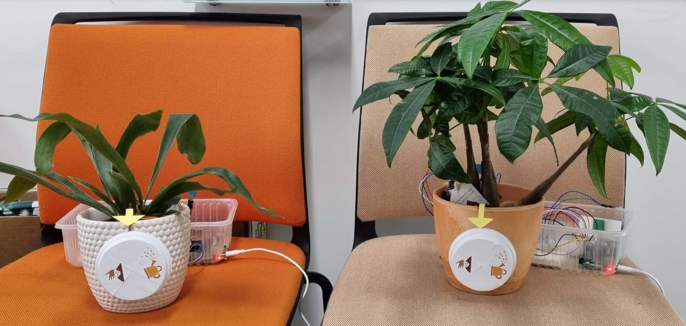

# Group-A-project: Grow Together
  >How to make asynchronous interaction between elderly and children

## Project idea
This project focuses on encouraging the connection between elderly and children through using simple technology

One side will be for the grandparent (the guide side), which the other grandchild side will follow (the follower).
The sensors will sense the activity done on the guide side and send the signals to the follower side, which will display the activity done by the guide (compost or watering) through the dial.
After the follower completes the task, the sensors on that side will send the reading to the guide side to display that the activiy has been done by the follower.

## Components used
For accomplishing this, we needed the following components were used for each plant pot:
1. Raspberry Pi 4
2. Ultrasonic sensor
3. Servo motor
4. Humidity sensor

## Technology used
- [Socket.io](https://socket.io/) was used to establish a connection between both Raspberry Pis.
- JavaScript and [Node.js](https://nodejs.org/en/).
- Visual Studio Code software, version 1.65.2
- Libraries: 
1.  socket.io: for server socket 
2. socket.io-client: for client socket: 
3. node-dht-sensor: for humidity sensor
4. pigpio: for servo motor and ultrasonic sensor
5. onoff: for servo motor and ultrasonic sensor

